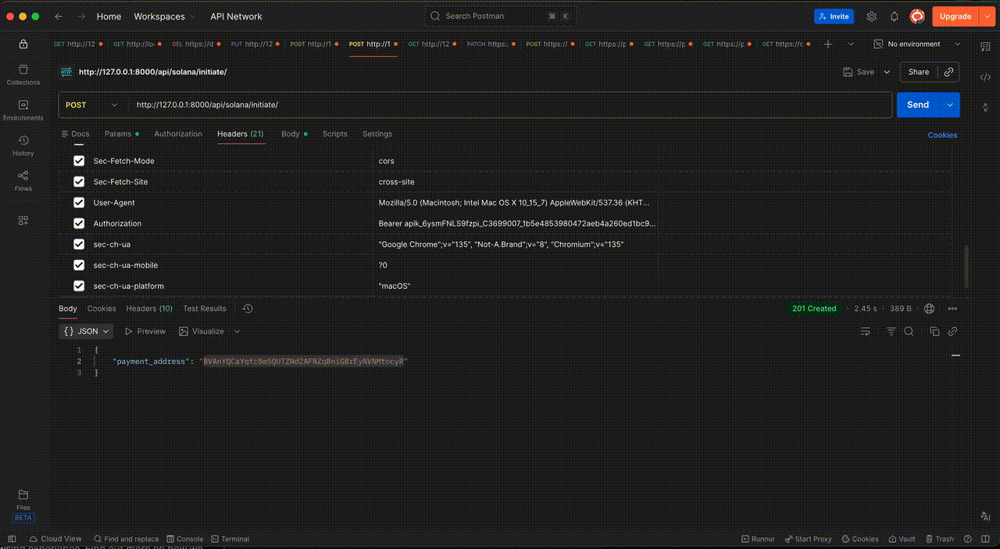

# Django Solana Payments


[](https://coveralls.io/github/Artemooon/django-solana-payments?branch=main)
[](https://badge.fury.io/py/django-solana-payments)
[]( https://pypi.python.org/pypi/django-solana-payments)
[](https://github.com/Artemooon/django-solana-payments/blob/main/LICENSE)

A Django library for accepting self-hosted online payments via the Solana blockchain. It provides payment verification logic and a reusable frontend widget for running self-hosted Solana payment infrastructure inside your Django project.
Under the hood, it builds on the open source [solana-py](https://github.com/michaelhly/solana-py) library for interacting with the Solana blockchain.

## Key Features

-   **Transaction verification and automatic payment confirmation**: Monitors the Solana blockchain, verifies incoming transactions, and automatically confirms payments when the expected amount is received.
-   **Built-in Solana payment widget**: Render a reusable solana payment widget with QR code and crypto wallet connection.
-   **Multi-token support (SOL and SPL tokens)**: Configure a list of active payment tokens (for example, SOL and USDC) and the library will use them for pricing and verification flows.
-   **Flexibility and customization**: Use your own custom models for payments and tokens to fit your project's needs. Add custom logic using signals or callabacks.
-   **Ease of integration**: Provides ready-to-use endpoints that can be used in existing DRF applications, or ready-to-use methods for Django applications that are not part of DRF.
-   **Security and encryption**: Provides an out-of-the-box encryption mechanism that helps keep one-time payment wallets secure.
-   **Management commands**: Includes management commands for handling expired payments and sending funds from one-time wallets.

## Documentation

See the full documentation at https://django-solana-payments.readthedocs.io/

## Installation

1.  **Install the package**
    ```bash
    pip install django-solana-payments
    ```

    For DRF support, which provides API endpoints for creating and managing payments, install the `drf` extra:
    ```bash
    pip install "django-solana-payments[drf]"
    ```
    This provides ready-to-use API endpoints for creating and managing payments.

    For `django-payments` integration support, install the `django-payments` extra:
    ```bash
    pip install "django-solana-payments[django-payments]"
    ```
    This provides the `django-payments` provider and checkout widget integration.

2.  **Configure `settings.py`**
    ```python
    INSTALLED_APPS = [
        ...,
        'django_solana_payments',
    ]

    SOLANA_PAYMENTS = {
        "RPC_URL": "https://api.mainnet-beta.solana.com",
        "RECEIVER_ADDRESS": "YOUR_WALLET_ADDRESS", # Wallet that receives funds
        "FEE_PAYER_KEYPAIR": "WALLET_KEYPAIR", # Wallet keypair that pays network fees (address will be derived from the keypair)
        # FEE_PAYER_ADDRESS is derived from FEE_PAYER_KEYPAIR; you don't normally need to set it separately.
        "RPC_TIMEOUT": 10, # Optional AsyncClient timeout in seconds
        "RPC_EXTRA_HEADERS": None, # Optional dict of extra RPC headers
        "RPC_PROXY": None, # Optional proxy URL
        "RPC_RATE_LIMIT": 0, # Optional AsyncClient rate limit; 0 disables limiter
        "ONE_TIME_WALLETS_ENCRYPTION_ENABLED": True, # Enables encryption for one-time solana_payments wallets
        "ONE_TIME_WALLETS_ENCRYPTION_KEY": "ONE_TIME_WALLETS_ENCRYPTION_KEY", # Generate with the Fernet.generate_key()
        "SOLANA_PAYMENT_MODEL": "solana_payments.CustomSolanaPayment", # Custom model for solana payment
        "PAYMENT_CRYPTO_TOKEN_MODEL": "solana_payments.CustomPaymentToken", # Custom model for solana payment token
        "RPC_COMMITMENT": "Confirmed", # RPC Commitment
        "PAYMENT_ACCEPTANCE_COMMITMENT": "Confirmed", # Commitment for payment acceptance
        "MAX_ATAS_PER_TX": 8, # Max associated token accounts to create/close per transaction (needed for oen time wallets creation)
        "PAYMENT_VALIDITY_SECONDS": 30 * 60, # Payment validity window in seconds (default: 30 minutes)
    }
    ```

3.  **Migrate and Route**
```bash
python manage.py migrate
```

```python
# Add this to your urls.py
urlpatterns = [
    path('solana-payments/', include('django_solana_payments.urls')),
]
```

4. **Open the admin panel and create payment token records, specifying the correct mint addresses for SPL tokens.**

## Integration in 3 simple steps

Start accepting Solana payments with a fast, production-ready flow designed for real checkout UX.

### Integration flow

Typical API flow:

1. Call `POST /solana-payments/initiate/` to create a payment and receive `payment_address`.
2. Show that address/QR code to the payer, then the payer sends funds to the `payment_address`.
3. Poll `GET /solana-payments/verify-transfer/{payment_address}?token_type=...` until status becomes `confirmed` or `finalized`.

Common UI examples:

- Use the built-in Solana payment widget -> render QR code, wallet actions, token selection, and verification flow on your payment page.
- Connect crypto wallet -> show payment summary in the wallet extension -> user signs and sends transaction -> app checks payment status.
- Open wallet app (Phantom/Solflare/mobile wallet) -> scan the QR code -> send expected amount -> return to your app -> app payment checks status.

Optionally call `GET /solana-payments/payments/{payment_address}/` for details.

## Demo 

[](./docs/assets/postman-demo.gif)

Release history and upgrade notes can be found in [CHANGELOG.md](./CHANGELOG.md).

## Running the Example Project

The included example project provides a demonstration of how to use the library and what it can do. To run it:

1.  **Navigate to the example project directory**
    ```bash
    cd examples/demo_project
    ```

2.  **Install dependencies**
    ```bash
    pip install -r requirements.txt
    ```

3.  **Run migrations**
    ```bash
    python mange.py makemigrations
    python manage.py migrate
    ```

4.  **Start the development server**
    ```bash
    ./dev_server.sh
    ```

## Running Tests

To run the tests for the library:

1.  **Install test dependencies**
    ```bash
    pip install pytest pytest-django
    ```

2.  **Run the tests**
    ```bash
    pytest
    ```

## License 

This package is licensed under the MIT License. See the LICENSE file for more details.

## Contributing

Contributions are welcome. Please read [CONTRIBUTING.md](./CONTRIBUTING.md) for setup instructions, testing, feature proposals, and pull request guidelines.

If you find this project useful, consider giving it a star to support its development!

## Developer Guide

### Local setup

1. Clone the repository and create a virtual environment:

   ```bash
   git clone https://github.com/Artemooon/django-solana-payments.git
   cd django-solana-payments
   python -m venv .venv
   source .venv/bin/activate
   ```

2. Install development dependencies:

   ```bash
   pip install -e ".[dev,docs,drf]"
   ```

3. Run tests:

   ```bash
   pytest
   ```

4. Build docs locally:

   ```bash
   cd docs
   make html
   ```

### Install pre-commit

Install and enable git hooks:

```bash
pip install pre-commit # (if not installed)
pre-commit install
```

### Release process

1. Bump version in `pyproject.toml`.
2. Commit and tag:

   ```bash
   git add -A
   git commit -m "Release x.y.z"
   git tag vx.y.z
   git push origin main --tags
   ```

The GitHub `Release` workflow publish automatically on pushed tags.
